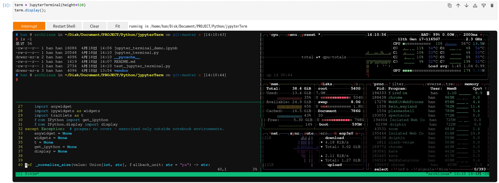

# Jupyter Terminal

这是一个给 Jupyter Notebook 和 JupyterLab 用的终端组件。

先说清楚一件事：Jupyter 本身是有 Terminal 的，这个项目不是为了替代它。

这个组件主要是给那些“不让你打开 Jupyter Terminal，但还允许你运行 notebook”的环境准备的。常见情况是：

- 托管式 Jupyter 环境把 Terminal 入口关掉了
- 平台只允许你在 notebook 页面里工作
- 你需要在 notebook 里直接嵌一个可交互的 shell，而不是切到别的页面

这也是它和“在 cell 里跑几条 shell 命令”之间的区别。很多 notebook 里的“终端”其实只是个输入框，跑几条命令还行，一碰到交互程序就露馅了。这个项目走的不是那条路，它后端起的是真 PTY，前端用的是 `xterm.js`，所以用起来会更像你平时开的终端模拟器。



现在这版支持的东西包括：

- 后端使用伪终端 `PTY`
- 前端使用 `xterm.js`
- 通过 widget custom message 与内核通信
- shell prompt
- ANSI 颜色和光标控制
- `Ctrl+C`
- Tab 补全
- `vim`、`less`、`top` 这类 TTY 程序
- 窗口 resize

## 文件

- `jupyter_terminal.py`: 终端组件本体
- `jupyter_terminal_demo.ipynb`: 可以直接打开的示例 notebook
- `test_jupyter_terminal.py`: 后端 PTY 会话测试
- `vendor/xterm/`: 本地前端资源

## 环境

当前实现面向 POSIX 环境：

- Linux
- macOS

依赖不多，主要是：

- Python
- Jupyter Notebook 或 JupyterLab
- `ipywidgets`
- `anywidget`

已验证的环境：

- 本机 Python 3.14
- Python 3.6

## 快速开始

在 notebook 里直接运行：

```python
from jupyter_terminal import JupyterTerminal

term = JupyterTerminal(height=520)
term.display();
```

如果你改过模块，想在当前内核里重新加载：

```python
import importlib
import jupyter_terminal

importlib.reload(jupyter_terminal)
from jupyter_terminal import JupyterTerminal
```

## 运行示例

直接打开 `jupyter_terminal_demo.ipynb`，按顺序运行前两个代码单元就行。

## 测试

```bash
pytest -q
```

如果你要在 Python 3.6 环境里测：

```bash
conda run -n <your-py36-env> pytest -q
```

示例 notebook 也可以这样执行：

```bash
conda run -n <your-py36-env> jupyter nbconvert --to notebook --execute jupyter_terminal_demo.ipynb --output /tmp/jupyter_terminal_demo.py36.ipynb
```

现在的测试主要覆盖这几块：

- 交互 shell 启动与输出
- `stty size` 随窗口 resize 更新
- `SIGINT` 中断后恢复控制

## 已知限制

- 当前后端仅支持 POSIX，不支持 Windows `ConPTY`
- 前端资源虽然已经本地化了，但 notebook 前端还是得能正常加载 `ipywidgets` 和 `anywidget`
- 这份代码支持 Python 3.6，所以后面改动时也得继续守住这条兼容线
